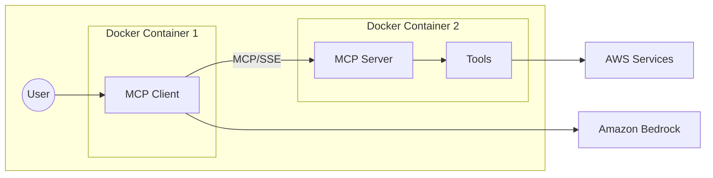

# Amazon Bedrock Model Context Protocol (MCP) Demo

This repository demonstrates the implementation and usage of the Model Context Protocol (MCP) with [Amazon Bedrock](https://docs.aws.amazon.com/bedrock/latest/userguide/what-is-bedrock.html?trk=64e03f01-b931-4384-846e-db0ba9fa89f5&sc_channel=code), showcasing how both client and server components can be built. The demo provides an interactive chat interface powered by Amazon Bedrock, allowing users to interact with various tools and services through natural language.

## Architecture Overview



The project consists of two main components:

1. **MCP Server**: A TypeScript/Node.js server that:
   - Handles incoming requests from the client
   - Manages tool registration and execution
   - Interfaces with AWS services as resources
   - Provides type-safe implementation of tools and services

2. **MCP Client**: A TypeScript/Node.js client that:
   - Provides an interactive chat interface using [Amazon Bedrock Converse API](https://docs.aws.amazon.com/bedrock/latest/APIReference/API_runtime_Converse.html?trk=64e03f01-b931-4384-846e-db0ba9fa89f5&sc_channel=code)
   - Communicates with the MCP server
   - Handles user input and displays responses
   - Manages the chat session state

The components are containerized using Docker for consistent deployment and easy setup. You may want to take this as a start for an MCP server deployment to Amazon ECS.

## Prerequisites

Before getting started, you'll need:

1. **AWS Account and CLI Setup**
   - An AWS Account with appropriate permissions
   - AWS CLI version 2 installed and configured (version 1 is not supported)
   - [AWS CLI Installation Guide](https://docs.aws.amazon.com/cli/latest/userguide/getting-started-install.html?trk=64e03f01-b931-4384-846e-db0ba9fa89f5&sc_channel=code)
   - [AWS CLI Configuration Guide](https://docs.aws.amazon.com/cli/latest/userguide/cli-configure-quickstart.html?trk=64e03f01-b931-4384-846e-db0ba9fa89f5&sc_channel=code)

2. **Amazon Bedrock Model Access**
   - Enable access to Amazon Bedrock foundation models in your AWS region
   - This code defaults to the "anthropic.claude-3-5-sonnet-20241022-v2:0" model
   - [Request Model Access Guide](https://docs.aws.amazon.com/bedrock/latest/userguide/model-access.html?trk=64e03f01-b931-4384-846e-db0ba9fa89f5&sc_channel=code)

3. **Docker Environment**
   - Docker Desktop installed and running
   - Docker Compose installed
   - [Docker Installation Guide](https://docs.docker.com/get-docker/)
   - [Docker Compose Installation Guide](https://docs.docker.com/compose/install/)

## Project Structure

```
.
└── converse-client-server-sse-demo-docker/
   ├── client/          # MCP client implementation
   ├── server/          # MCP server implementation
   ├── scripts/         # Helper scripts for building and running
   └── docker-compose.yml  # Container orchestration
```

## Getting Started

### Building the Application

Run the build script to create the Docker containers:

```bash
./scripts/build.sh
```

This script:
1. Builds the MCP server container
2. Builds the MCP client container
3. Handles any build errors gracefully

### Running the Application

Start the application using:

```bash
./scripts/run.sh
```

This script:
1. Verifies AWS credentials and exports them
2. Sets up the AWS region configuration
3. Starts the Docker containers
4. Waits for the server to be ready
5. Optionally connects you to the client app

### Stopping the Application

To stop all containers:

```bash
./scripts/stop.sh
```

## Using the Chat Interface

Once connected to the client app, you can interact with the system through natural language. Here are some example questions you can ask:

1. AWS-related S3 queries:
   - "How many S3 buckets do I have?"

2. Time queries:
   - "What's the current time in New York?"

## Extending the Server

To add new tools to the server:

1. Create a new tool file in `server/src/tools/`
2. Implement the tool interface with required methods
3. Register the tool in `server/src/tools/index.ts`
4. Rebuild and restart the containers

Example tool structure:
```typescript
export interface Tool {
  name: string;
  description: string;
  execute: (params: any) => Promise<any>;
}
```

## Contributing

Contributions are welcome! Please:

1. Fork the repository
2. Create a feature branch
3. Submit a pull request with detailed description
4. Ensure all tests pass

## License

[Add appropriate license information] 