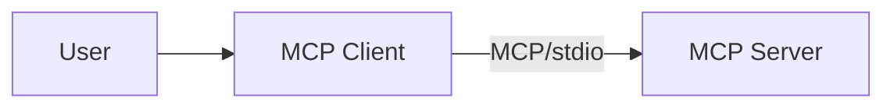

# MCP Client Bedrock Demo (stdio)

This project demonstrates an interactive CLI application that uses Model Context Protocol (MCP) with Amazon Bedrock's Converse API. It showcases how to build a chat interface with tool integration using the stdio communication protocol.



## Features

- 🤖 Interactive CLI chat 
- 🔄 MCP server/client architecture implementation
- 🛠️ Tool integration framework with example tools
- 🔗 Integration with Amazon Bedrock's Converse API

## Prerequisites

- Python 3.8 or higher
- AWS account with Bedrock access (this code uses 'anthropic.claude-3-5-sonnet-20241022-v2:0')
- AWS credentials configured locally
- `pip` package manager

## Project Structure

```
.
└── converse-client-server-stdio-demo-local/
   ├── app.py              # Main application entry point with CLI interface
   ├── mcp_server.py       # MCP server implementation
   ├── mcp_client.py       # MCP client implementation
   ├── converse_agent.py   # Conversation agent for managing interactions
   ├── converse_tools.py   # Tool management system
   └── requirements.txt    # Project dependencies
```

## Quick Start

1. **Clone the repository**


2. **Set up a virtual environment (recommended):**
   ```bash
   python -m venv venv
   source venv/bin/activate  # On Windows: venv\Scripts\activate
   ```

3. **Install dependencies:**
   ```bash
   pip install -r requirements.txt
   ```

4. **Configure AWS credentials:**
   Ensure your AWS credentials are configured with Bedrock access e.g:
   Set up your credentials file at `~/.aws/credentials`
   Or:
   ```bash
   aws configure
   ```
   Or use AWS SSO


5. **Run the application:**
   ```bash
   python app.py
   ```

## Example Usage

The demo includes two built-in tools:
1. **Calculator**: Performs mathematical calculations
2. **Weather Tool**: (Demo) Retrieves weather information

Try these example interactions:

```txt
User: What is 10 plus 132?

User: What is the weather like in Brisbane right now?

User: What is 123 plus the temperature in Brisbane right now?
```

## Dependencies

Core dependencies:
- `fastmcp==0.4.1`: MCP protocol implementation
- `boto3==1.37.19`: AWS SDK for Python
- `botocore==1.37.19`: Low-level AWS functionality
