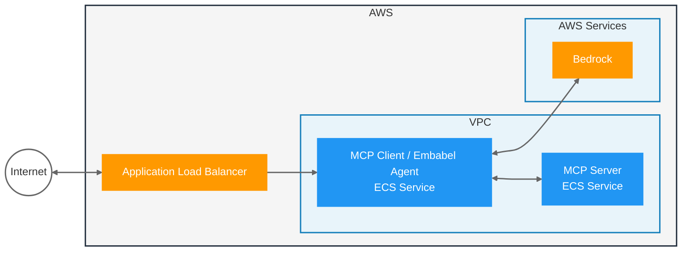

# Sample: MCP Agent with Embabel and Bedrock

Provides a sample Embabel MCP Agent with Spring AI using Bedrock that runs on ECS; which includes a server providing employee data and a client agent, both exposed publicly via a Load Balancer.



## Setup

1. Setup Bedrock in the AWS Console, [request access to Claude Sonnet 4](https://us-east-1.console.aws.amazon.com/bedrock/home?region=us-east-1#/modelaccess)
1. [Setup auth for local development](https://docs.aws.amazon.com/cli/v1/userguide/cli-chap-authentication.html)

### Helper Scripts

This project includes several helper scripts in the `infra/` directory to simplify AWS setup and deployment:

- **`infra/aws-checks.sh`** - Verifies your AWS environment is properly configured:
  - Checks AWS CLI authentication and permissions
  - Verifies Bedrock access and Claude Sonnet 4 model availability
  - Validates ECR repositories exist
  - Tests ECS task execution role permissions

- **`infra/setup-ecr.sh`** - Automates ECR repository creation and Docker authentication:
  - Creates ECR repositories for both server and client images
  - Configures Docker to authenticate with ECR
  - Sets up proper repository lifecycle policies
  - Provides the ECR_REPO environment variable for builds

- **`infra/build-push.sh`** - Builds and pushes Docker images to ECR:
  - Builds Spring Boot Docker images for both server and client
  - Tags and pushes images to ECR
  - Handles authentication and error checking

- **`infra/deploy.sh`** - Modular deployment script with multiple options:
  - Orchestrates all deployment tasks
  - Provides granular control over infrastructure components
  - Supports partial updates and cleanup operations

## Run Locally

Start the MCP Server:
```
./mvnw -pl server spring-boot:run
```

Start the MCP Client / Agent:
```
# Use the provided shell script to ensure AWS credentials are properly exported
./run-client.sh

# Note: Direct maven command may fail with AWS credential errors because 
# the Spring Boot Maven plugin doesn't inherit AWS environment variables properly.
# The run-client.sh script explicitly exports AWS credentials before running.
```

Make a request to the server REST endpoint:

In IntelliJ, open the `client.http` file and run the request.

Or via `curl`:
```
curl -X POST --location "http://localhost:8080/inquire" \
    -H "Content-Type: application/json" \
    -d '{"question": "List employees with React skills"}'
```

## Run on AWS

### Prerequisites

- [Install Rain](https://github.com/aws-cloudformation/rain)
- AWS CLI configured with appropriate permissions
- Docker installed and running

### Infrastructure Overview

The infrastructure is now split into two CloudFormation stacks for faster, more flexible deployments:

1. **Base Stack** (`infra/base.cfn`): VPC, networking, security groups, IAM roles, load balancer (~10 min to deploy)
2. **Services Stack** (`infra/services.cfn`): ECS task definitions and services (~5 min to deploy/update)

This modular approach allows you to:
- Update services without touching base infrastructure (5 min vs 60+ min)
- Debug issues more easily with smaller, focused stacks
- Deploy and test components incrementally

### Quick Setup with Scripts

1. **Verify AWS Environment:**
   ```bash
   ./infra/deploy.sh aws-checks
   ```
   This will verify that your AWS environment is properly configured for deployment.

2. **Setup ECR Repositories:**
   ```bash
   ./infra/deploy.sh setup-ecr
   ```
   This will:
   - Create the required ECR repositories (`embabel-agent-ecs-server` and `embabel-agent-ecs-client`)
   - Configure Docker authentication with ECR
   - Output the ECR_REPO environment variable

3. **Build and Deploy Infrastructure:**
   ```bash
   # First time - deploy everything
   ./infra/deploy.sh all
   
   # Just update services after code changes
   ./infra/deploy.sh update-services
   
   # Check deployment status
   ./infra/deploy.sh status
   ```

### Infrastructure Deployment Commands

The `infra/deploy.sh` script provides these commands:

- `./infra/deploy.sh aws-checks` - Check AWS configuration and Bedrock access
- `./infra/deploy.sh setup-ecr` - Setup ECR repositories and Docker authentication  
- `./infra/deploy.sh build-push` - Build and push Docker images to ECR
- `./infra/deploy.sh all` - Deploy all infrastructure (base + services)
- `./infra/deploy.sh base` - Deploy only base infrastructure
- `./infra/deploy.sh services` - Deploy only services (requires base)
- `./infra/deploy.sh update-services` - Update services after code changes
- `./infra/deploy.sh status` - Show current deployment status
- `./infra/deploy.sh cleanup-services` - Remove services stack only
- `./infra/deploy.sh cleanup-base` - Remove base infrastructure
- `./infra/deploy.sh cleanup-all` - Remove all infrastructure
- `./infra/deploy.sh help` - Show help message

### Typical Workflows

**First Time Deployment:**
```bash
# Check AWS configuration
./infra/deploy.sh aws-checks

# Setup ECR repositories
./infra/deploy.sh setup-ecr

# Build and push images
./infra/deploy.sh build-push

# Deploy all infrastructure
./infra/deploy.sh all
```

**Update After Code Changes:**
```bash
# Rebuild and push updated images
./infra/deploy.sh build-push

# Update only the services (5 minutes instead of 60+)
./infra/deploy.sh update-services
```

**Clean Up:**
```bash
# Remove just services (keeps base infrastructure)
./infra/deploy.sh cleanup-services

# Or remove everything
./infra/deploy.sh cleanup-all
```

### Alternative: Individual Script Usage

If you prefer to run scripts individually instead of using the orchestrated `deploy.sh`:

1. **Check AWS setup:**
   ```bash
   ./infra/aws-checks.sh
   ```

2. **Setup ECR repositories:**
   ```bash
   ./infra/setup-ecr.sh
   ```

3. **Build and push images:**
   ```bash
   ./infra/build-push.sh
   ```

4. **Deploy infrastructure manually with Rain:**
   ```bash
   # Deploy base infrastructure
   rain deploy infra/base.cfn embabel-agent-base
   
   # Deploy services
   rain deploy infra/services.cfn embabel-agent-services --params BaseStackName=embabel-agent-base
   ```

### Troubleshooting

- **Pre-flight Check**: Run `./infra/deploy.sh aws-checks` to verify your AWS configuration and Bedrock model access
- **AWS Credentials Error**: If you see "Missing required AWS_ACCESS_KEY_ID" or similar errors, use the `run-client.sh` script instead of running Maven directly. The script exports AWS credentials from your configured profile.
- **Region Configuration**: The application requires AWS region `us-east-1` for Bedrock model access
- Ensure AWS credentials are configured for Bedrock access
- Check that both services are running before testing
- Server must be started before client
- Use Spring Boot Actuator endpoints for health checks

End-to-end Test with `curl`:
```
curl -X POST --location "http://YOUR_LB_HOST/inquire" \
-H "Content-Type: application/json" \
-d '{"question": "List employees with React skills"}'
```