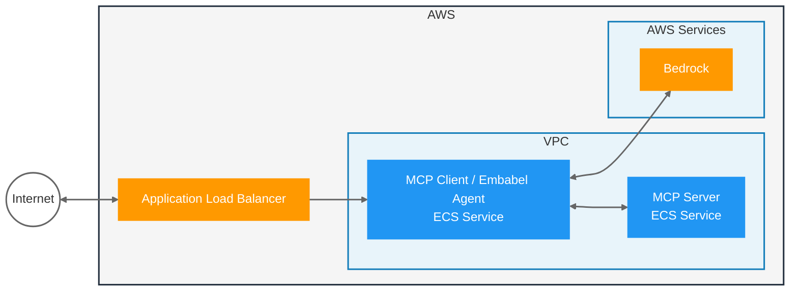

# Sample: MCP Agent with Embabel and Bedrock

TODO: Description



## Setup

1. Setup Bedrock in the AWS Console, [request access to claude-sonnet-4](https://us-east-1.console.aws.amazon.com/bedrock/home?region=us-east-1#/modelaccess)
1. [Setup auth for local development](https://docs.aws.amazon.com/cli/v1/userguide/cli-chap-authentication.html)
1. Verify your AWS configuration by running: `./aws-checks.sh`

## Run Locally

Start the MCP Server:
```
./mvnw -pl server spring-boot:run
```

Start the MCP Client / Agent:
```
# Use the provided shell script to ensure AWS credentials are properly exported
./run-client.sh

# Note: Direct maven command may fail with AWS credential errors because 
# the Spring Boot Maven plugin doesn't inherit AWS environment variables properly.
# The run-client.sh script explicitly exports AWS credentials before running.
```

### Troubleshooting

- **AWS Credentials Error**: If you see "Missing required AWS_ACCESS_KEY_ID" or similar errors when running the client, use the `run-client.sh` script instead of running Maven directly. The script exports AWS credentials from your configured profile.
- **Region Configuration**: The application requires AWS region `us-east-1` for Bedrock model access (configured in application.properties)

Make a request to the server REST endpoint:

In IntelliJ, open the `client.http` file and run the request.

Or via `curl`:
```
curl -X POST --location "http://localhost:8080/inquire" \
    -H "Content-Type: application/json" \
    -d '{"question": "Get employees that have AI related skills"}'
```

## TODO Below Here

## Run on AWS

Prereqs:
- [Install Rain](https://github.com/aws-cloudformation/rain)
- Ensure Docker is running

Setup ECR repositories and authenticate Docker:
```
./setup-ecr.sh
```

This script will:
- Create ECR repositories if they don't exist
- Authenticate Docker with ECR
- Can be run multiple times to refresh authentication

Build and push Docker images to ECR:
```
./build-agent.sh
```

This script will:
- Verify ECR repositories exist
- Authenticate with ECR if needed
- Build Spring Boot Docker images
- Push images to ECR
- Show progress for each step

Deploy the Agent:
```
rain deploy infra.cfn embabel-agent-ecs
```

End-to-end Test with `curl`:
```
curl -X POST --location "http://YOUR_LB_HOST/inquire" \
-H "Content-Type: application/json" \
-d '{"question": "Get employees that have skills related to Java, but not Java"}'
```
