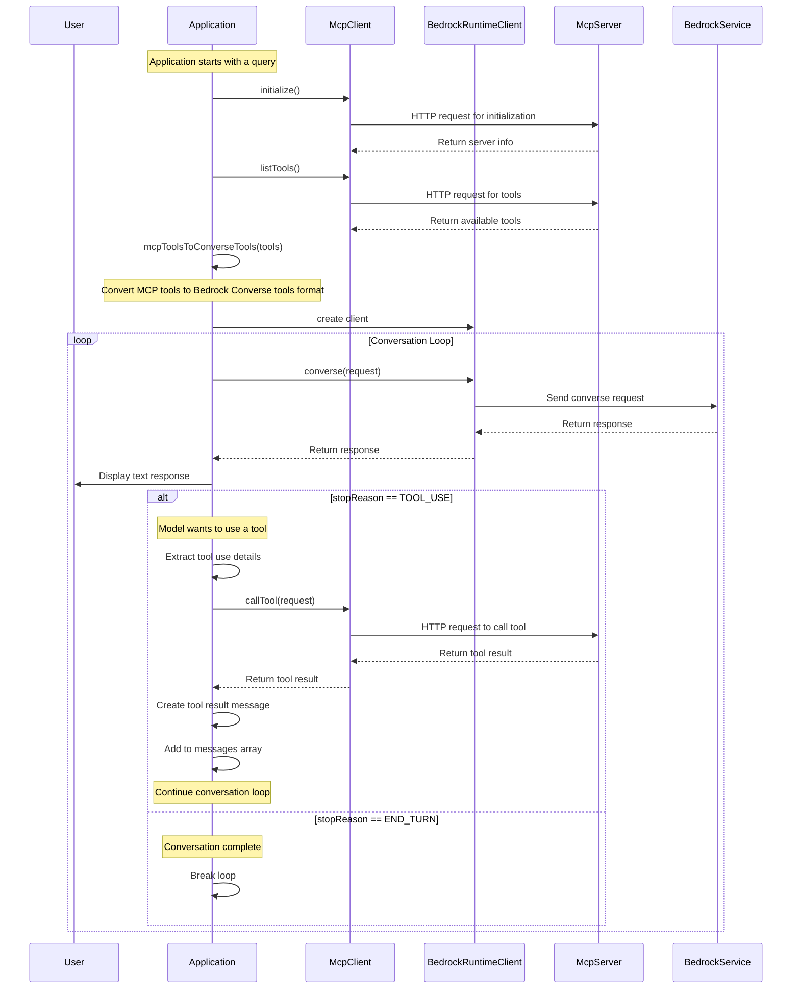

# Sample: MCP Agent with Bedrock

> A multi-turn agent using Amazon Bedrock Converse and the MCP Java SDK



## Setup

1. Setup Bedrock in the AWS Console, [request access to Nova Lite](https://us-east-1.console.aws.amazon.com/bedrock/home?region=us-east-1#/modelaccess)
1. [Setup auth for local development](https://docs.aws.amazon.com/cli/v1/userguide/cli-chap-authentication.html)

## Run The Agent

```
./mvnw compile exec:java
```

Resources:
- https://docs.aws.amazon.com/sdk-for-java/latest/developer-guide/java_bedrock-runtime_code_examples.html
- https://docs.aws.amazon.com/bedrock/latest/userguide/tool-use-inference-call.html
