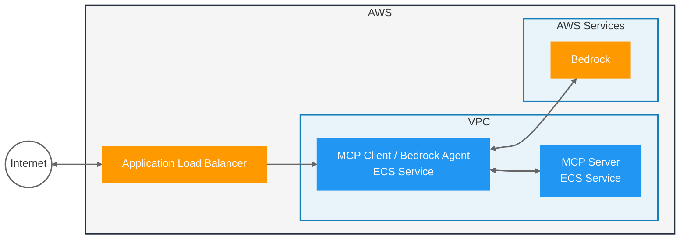

# Sample: MCP Agent with Spring AI and Bedrock

Provides a sample Spring AI MCP Server that runs on ECS; which is used by a Spring AI Agent using Bedrock; which also runs on ECS and is exposed publicly via a Load Balancer.



## Setup

1. Setup Bedrock in the AWS Console, [request access to Nova Pro](https://us-east-1.console.aws.amazon.com/bedrock/home?region=us-east-1#/modelaccess)
1. [Setup auth for local development](https://docs.aws.amazon.com/cli/v1/userguide/cli-chap-authentication.html)

### Helper Scripts

This project includes several helper scripts to simplify AWS setup and deployment:

- **`aws-checks.sh`** - Verifies your AWS environment is properly configured:
  - Checks AWS CLI authentication and permissions
  - Verifies Bedrock access and Nova Pro model availability
  - Validates ECR repositories exist
  - Tests ECS task execution role permissions

- **`setup-ecr.sh`** - Automates ECR repository creation and Docker authentication:
  - Creates ECR repositories for both server and client images
  - Configures Docker to authenticate with ECR
  - Sets up proper repository lifecycle policies
  - Provides the ECR_REPO environment variable for builds

- **`build-agent.sh`** - Builds, tags, and deploys the complete application:
  - Builds Spring Boot Docker images for both server and client
  - Tags and pushes images to ECR
  - Deploys the CloudFormation stack using Rain
  - Outputs the Load Balancer URL for testing

## Run Locally

Start the MCP Server:
```
./mvnw -pl server spring-boot:run
```

Start the MCP Client / Agent:
```
./mvnw -pl client spring-boot:run
```

Make a request to the server REST endpoint:

In IntelliJ, open the `client.http` file and run the request.

Or via `curl`:
```
curl -X POST --location "http://localhost:8080/inquire" \
    -H "Content-Type: application/json" \
    -d '{"question": "Get employees that have skills related to Java, but not Java"}'
```

## Run on AWS

### Prerequisites

- [Install Rain](https://github.com/aws-cloudformation/rain)
- AWS CLI configured with appropriate permissions
- Docker installed and running

### Quick Setup with Scripts

1. **Verify AWS Environment:**
   ```bash
   ./aws-checks.sh
   ```
   This script will verify that your AWS environment is properly configured for deployment.

2. **Setup ECR Repositories:**
   ```bash
   ./setup-ecr.sh
   ```
   This script will:
   - Create the required ECR repositories (`mcp-agent-spring-ai-server` and `mcp-agent-spring-ai-client`)
   - Configure Docker authentication with ECR
   - Output the ECR_REPO environment variable

3. **Build and Deploy:**
   ```bash
   ./build-agent.sh
   ```
   This script will:
   - Build both Spring Boot applications as Docker images
   - Push the images to ECR
   - Deploy the CloudFormation stack
   - Output the Load Balancer URL

### Manual Deployment

If you prefer to run the commands manually:

1. Create ECR repositories and authenticate Docker:
   ```bash
   aws ecr create-repository --repository-name mcp-agent-spring-ai-server --region us-east-1
   aws ecr create-repository --repository-name mcp-agent-spring-ai-client --region us-east-1
   
   export ECR_REPO=<your account id>.dkr.ecr.us-east-1.amazonaws.com
   aws ecr get-login-password --region us-east-1 | docker login --username AWS --password-stdin $ECR_REPO
   ```

2. Build and push the Docker images:
   ```bash
   ./mvnw -pl server spring-boot:build-image -Dspring-boot.build-image.imageName=$ECR_REPO/mcp-agent-spring-ai-server
   docker push $ECR_REPO/mcp-agent-spring-ai-server:latest

   ./mvnw -pl client spring-boot:build-image -Dspring-boot.build-image.imageName=$ECR_REPO/mcp-agent-spring-ai-client
   docker push $ECR_REPO/mcp-agent-spring-ai-client:latest
   ```

3. Deploy the CloudFormation stack:
   ```bash
   rain deploy infra.cfn spring-ai-agent-ecs
   ```

End-to-end Test with `curl`:
```
curl -X POST --location "http://YOUR_LB_HOST/inquire" \
-H "Content-Type: application/json" \
-d '{"question": "Get employees that have skills related to Java, but not Java"}'
```
