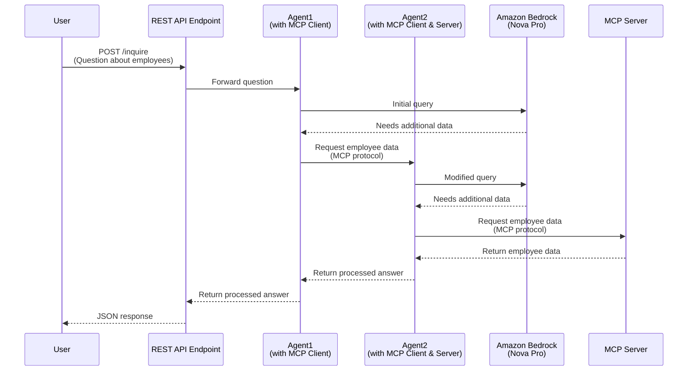

# Sample: MCP Inter-Agent with Spring AI and Bedrock

MCP-based agents (Bedrock + MCP client) can call other MCP-based agents by exposing them as MCP servers.
This example uses a hierarchy of agents with where the outer agent calls (using MCP) an inner agent that does routing and prompt modification, which then calls another MCP server.



## Setup

1. Setup Bedrock in the AWS Console, [request access to Nova Pro](https://us-east-1.console.aws.amazon.com/bedrock/home?region=us-east-1#/modelaccess)
1. [Setup auth for local development](https://docs.aws.amazon.com/cli/v1/userguide/cli-chap-authentication.html)

## Run Locally

Start the MCP Server:
```
./mvnw -pl server spring-boot:run
```

Start the MCP Server:
```
./mvnw -pl client-server spring-boot:run
```

Start the MCP Client / Agent:
```
./mvnw -pl client spring-boot:run
```

Make a request to the server REST endpoint:

In IntelliJ, open the `client.http` file and run the request.

Or via `curl`:
```
curl -X POST --location "http://localhost:8080/inquire" \
    -H "Content-Type: application/json" \
    -d '{"question": "Get employees that have skills related to Java, but not Java"}'
```

## Run on AWS

Prereqs:
- [Create an ECR Repos](https://us-east-1.console.aws.amazon.com/ecr/private-registry/repositories/create?region=us-east-1)
  - `spring-ai-mcp-inter-agent-ecs-server`
  - `spring-ai-mcp-inter-agent-ecs-client-server`
  - `spring-ai-mcp-inter-agent-ecs-client`
- [Auth `docker` to ECR](https://docs.aws.amazon.com/AmazonECR/latest/userguide/registry_auth.html)
  - i.e. `aws ecr get-login-password --region us-east-1 | docker login --username AWS --password-stdin $ECR_REPO`
- [Install Rain](https://github.com/aws-cloudformation/rain)

Build and push the MCP Server & MCP Client to ECR:
```
export ECR_REPO=<your account id>.dkr.ecr.us-east-1.amazonaws.com

./mvnw -pl server spring-boot:build-image -Dspring-boot.build-image.imageName=$ECR_REPO/spring-ai-mcp-inter-agent-ecs-server
docker push $ECR_REPO/spring-ai-mcp-inter-agent-ecs-server:latest

./mvnw -pl client-server spring-boot:build-image -Dspring-boot.build-image.imageName=$ECR_REPO/spring-ai-mcp-inter-agent-ecs-client-server
docker push $ECR_REPO/spring-ai-mcp-inter-agent-ecs-client-server:latest

./mvnw -pl client spring-boot:build-image -Dspring-boot.build-image.imageName=$ECR_REPO/spring-ai-mcp-inter-agent-ecs-client
docker push $ECR_REPO/spring-ai-mcp-inter-agent-ecs-client:latest
```

Deploy the Agent:
```
rain deploy infra.cfn spring-ai-mcp-inter-agent-ecs
```

End-to-end Test with `curl`:
```
curl -X POST --location "http://YOUR_LB_HOST/inquire" \
-H "Content-Type: application/json" \
-d '{"question": "Get employees that have skills related to Java, but not Java"}'
```
