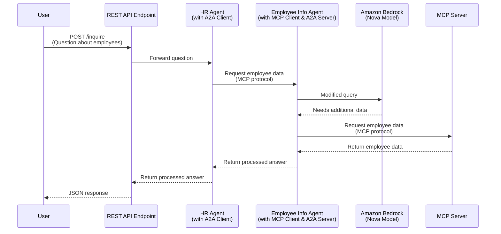

Strands A2A Inter-Agent Sample
------------------------------



## Setup

1. Setup Bedrock in the AWS Console, [request access to Nova Micro](https://us-east-1.console.aws.amazon.com/bedrock/home?region=us-east-1#/modelaccess)
1. [Setup auth for local development](https://docs.aws.amazon.com/cli/v1/userguide/cli-chap-authentication.html)

## Run Locally

Start the Employee MCP Server
```
uv run employee-server/server.py
```

Start the Employee Agent:
```
uv run employee-agent/agent.py
```

Start the HR Agent:
```
uv run hr-agent/agent.py
```

Make a request to the server REST endpoint:

In IntelliJ, open the `client.http` file and run the request.

Or via `curl`:
```
curl -X POST --location "http://localhost:8000/inquire" \
    -H "Content-Type: application/json" \
    -d '{"question": "list employees that have skills related to AI programming"}'
```

## Run on AWS

Prereqs:
- [Create an ECR Repo](https://us-east-1.console.aws.amazon.com/ecr/private-registry/repositories/create?region=us-east-1)
  - `strands-a2a-inter-agent`
- Set the `ECR_REPO` env var:
    ```
    export ECR_REPO=<your account id>.dkr.ecr.us-east-1.amazonaws.com
    ```
- [Auth `docker` to ECR](https://docs.aws.amazon.com/AmazonECR/latest/userguide/registry_auth.html)
  - i.e. `aws ecr get-login-password --region us-east-1 | docker login --username AWS --password-stdin $ECR_REPO`
- [Install Rain](https://github.com/aws-cloudformation/rain)
- [Install Pack](https://buildpacks.io/docs/for-platform-operators/how-to/integrate-ci/pack/)

Build and push the MCP Server & MCP Client to ECR:
```
pack build $ECR_REPO/strands-a2a-inter-agent:latest --builder=heroku/builder:24 --publish
```

Deploy on AWS:
```
rain deploy infra.cfn strands-a2a-inter-agent
```

End-to-end Test with `curl`:
```
curl -X POST --location "http://YOUR_LB_HOST/inquire" \
-H "Content-Type: application/json" \
-d '{"question": "list employees that have skills related to AI programming"}'
```

## Testing Containers

```
docker network create strands-a2a-inter-agent
docker run -it --rm --network=strands-a2a-inter-agent --name=employee-server -p8002:8002 $ECR_REPO/strands-a2a-inter-agent:latest "python employee-server/server.py"
docker run -it --rm --network=strands-a2a-inter-agent --name=employee-agent --env=EMPLOYEE_INFO_URL=http://employee-server:8002/mcp/ --env=EMPLOYEE_AGENT_URL=http://employee-agent:8001/ --env=AWS_ACCESS_KEY_ID=$AWS_ACCESS_KEY_ID --env=AWS_SECRET_ACCESS_KEY=$AWS_SECRET_ACCESS_KEY -p8001:8001 $ECR_REPO/strands-a2a-inter-agent:latest "python employee-agent/agent.py"
docker run -it --rm --network=strands-a2a-inter-agent --env=EMPLOYEE_AGENT_URL=http://employee-agent:8001/ --env=AWS_ACCESS_KEY_ID=$AWS_ACCESS_KEY_ID --env=AWS_SECRET_ACCESS_KEY=$AWS_SECRET_ACCESS_KEY -p8000:8000 $ECR_REPO/strands-a2a-inter-agent:latest "python hr-agent/agent.py"
```
